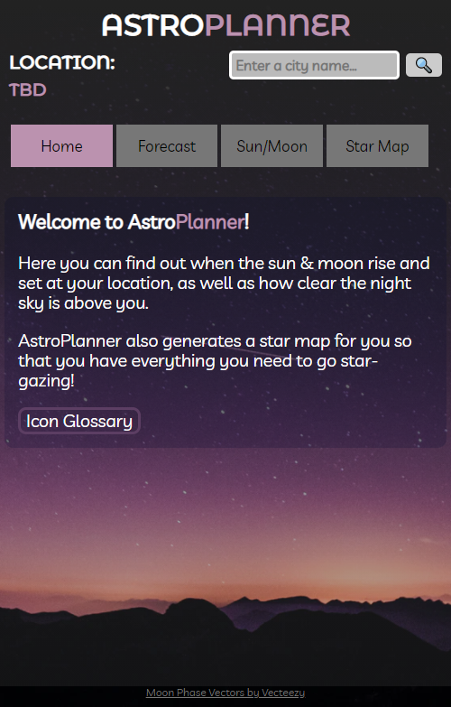
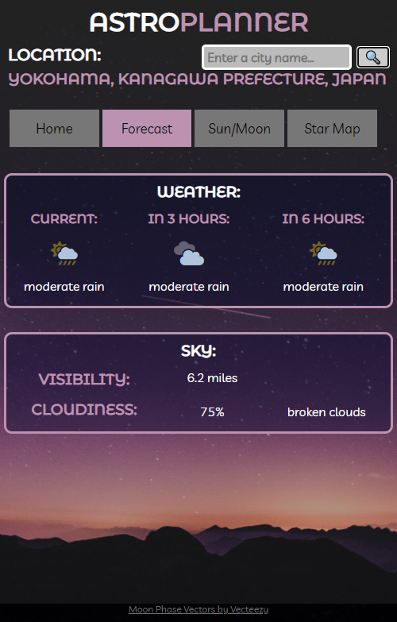
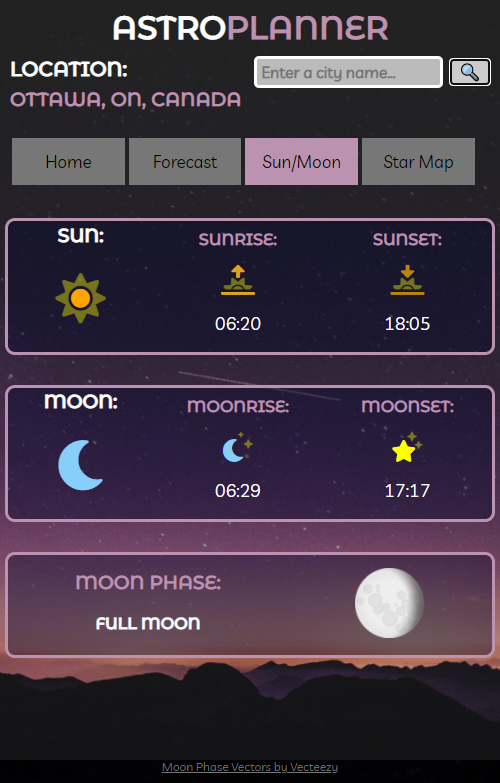
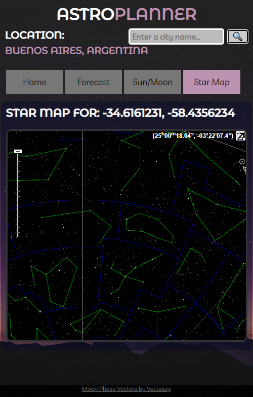
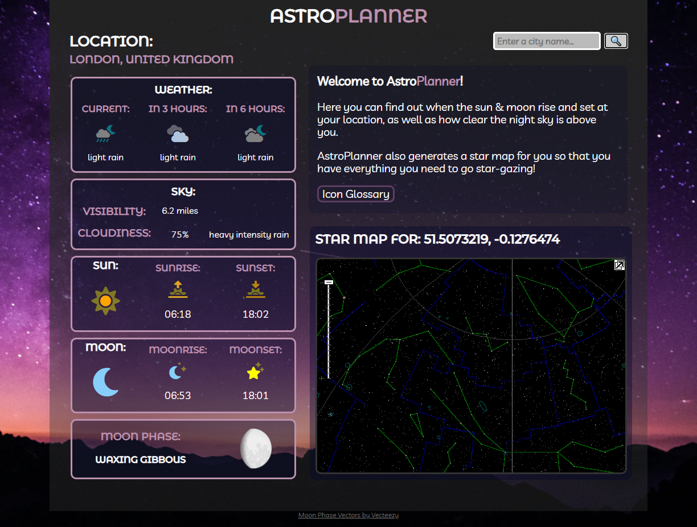

# :stars: AstroPlanner
A user-friendly, open source web application to plan your nights of star-gazing.

## :book: Table of Contents
1. [Motivation](#motivation)
2. [Concept](#concept)
3. [Technologies Used](#tech)
4. [Features](#features)
5. [Deployed Application](#app)
6. [Credits](#credits)

### :star2: Motivation: 
#### User Story:
**AS A** curious person/ citizen of the world  
**I WANT** to see space maps and weather  
**SO THAT** I can make plans for stargazing 

### :writing_hand: Concept: 
A user-friendly web application to plan your nights of star gazing. Whenever you want to go stargazing you can check AstroPlanner to decide if right now is a good time to go out and see the stars! 

### :bulb: Technologies Used:  
* Languages:
  * HTML
  * CSS
  * JS
  * jQuery
* APIs:
  * SkyMap
  * IPGeolocation.io
  * VisualCrossing.com  

### :mage: Features:  
* Unique mobile and desktop layouts
* Star Map to help you understand the skies above
* Rising and Setting of the sun and moon, so you can plan lighting for photography or just to get the best view possible
* Cities that you search are stored in localStorage for quick access.

### :milky_way: Deployed Application:  

https://fiskoal.github.io/astroplanner/

#### :iphone: Mobile Layout:
<table>
  <tr>
    <td>Home Tab</td><td>Forecast Tab</td><td>Sun & Moon Tab</td><td>Star Map Tab</td>
  </tr>
  <tr>
    <td>  </td> <td>  </td> <td>  </td> <td>  </td>
  </tr>
 </table>

#### :computer: Desktop Layout:

### :clap: Credits  
- [Background photo by Vincentiu Solomon](https://unsplash.com/photos/ln5drpv_ImI)
- <a href="https://www.vecteezy.com/free-vector/moon">Moon Phase Icon Vectors by Vecteezy</a>

##### Todo:
add URLs to all the API's
add URLs to the credit stuffs
add favicon
 
